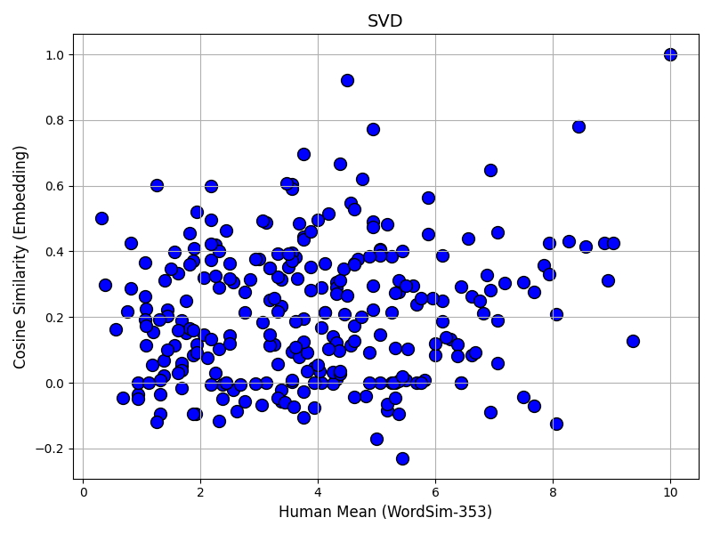
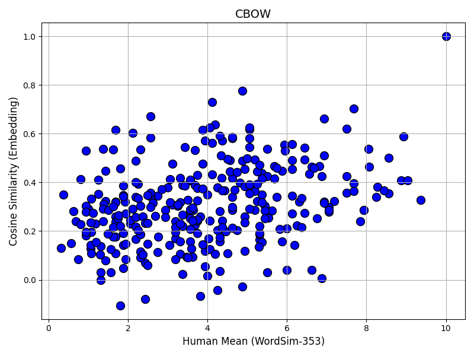
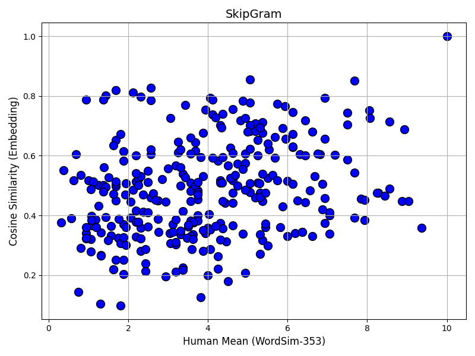
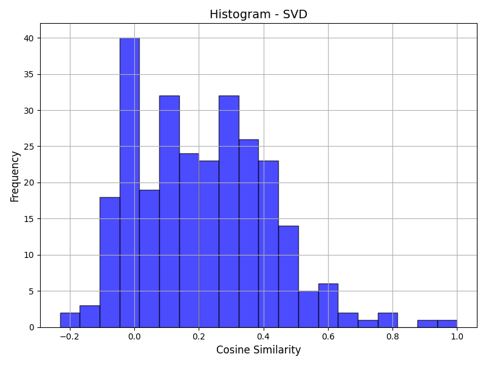
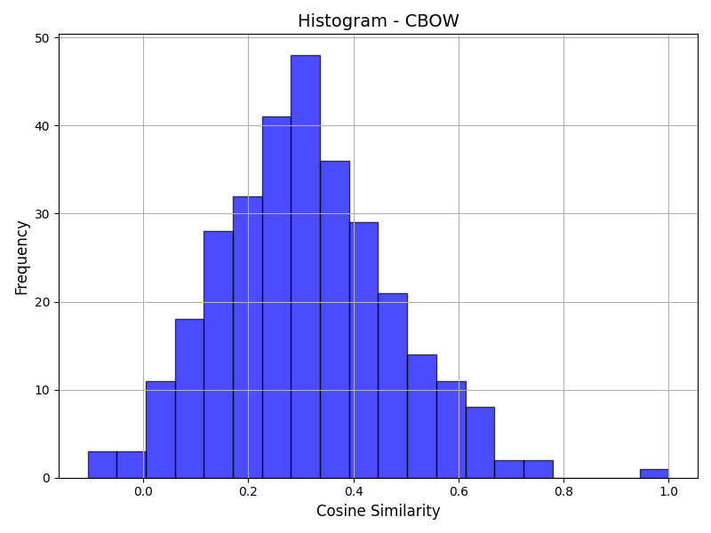
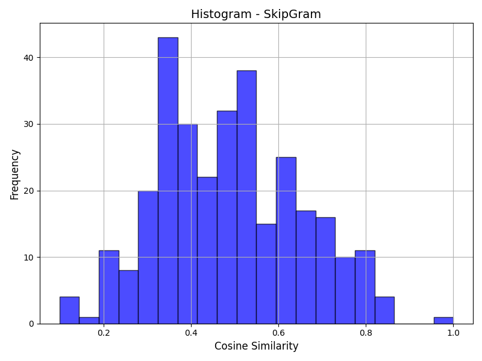

# Assignment 3 - Report

## Objective

Word embeddings are a key component in modern Natural Language Processing (NLP) systems, allowing words to be represented as dense vectors in a high-dimensional space, where semantically similar words are positioned closer together. There are two main categories of word embedding algorithms: frequency-based and prediction-based.

Frequency-based models, like SVD (Singular Value Decomposition), rely on statistical methods such as co-occurrence matrices to generate embeddings based on word frequency within a fixed context. On the other hand, prediction-based models like Word2Vec, which includes CBOW (Continuous Bag of Words) and Skip-Gram, learn embeddings by predicting the context of a word or predicting a word from its context.

We would be implementing the 3 models

----------------------

## Hyperparameters 

Following are the hyperparameters for optimal result as far being tested :
### SVD :

- Embedding Dimension: 200
- Window Size: 2

### CBOW :

- Embedding Dimension: 100
- Learning Rate: 0.005
- Window Size: 2
- Negative Samples: 20
- Batch Size: 64
- Epochs: 5

### SkipGram :

- Embedding Dimension: 100
- Learning Rate: 0.005
- Window Size: 2
- Negative Samples: 20
- Batch Size: 64
- Epochs: 10

----------------------

## Results :

Spearman Correlation Value -

- SVD : 0.10939018478796167
- CBOW : 0.32734168370410177
- Skipgram : 0.2815607502355972

--------------------------

## Analysis

### SVD
Singular Value Decomposition (SVD), a frequency-based method.

- SVD decomposes the co-occurrence matrix of words into three matrices, capturing latent semantic structures and relationships between words.

We could see the lowest Correlation value by SVD.

This makes the method relatively ineffective.

----
- Simple, interpretable, and efficient for small corpora.
- Computationally less intensive compared to neural network-based methods.
-----
- Struggles to capture complex semantic relationships between words, especially for large corpora. Also lacks the ability to efficiently incorporate negative sampling,
- Results in sparse word embeddings, less flexible than neural-based models.

### CBOW

Continuous Bag of Words, a Prediction based method

- CBOW predicts a target word from its surrounding context words using a shallow neural network.

Spearman Correlation is typically higher than SVD since CBOW directly learns from context and captures word relationships well.

-----
- Efficient for large datasets, captures word meanings based on surrounding context.
- Produces dense, continuous word embeddings that are more flexible and semantically rich compared to SVD.
----
- Requires significant computational resources and time to train, especially with large vocabularies.Performance is sensitive to hyperparameters, like context window size and learning rate.

### Skipgram

Skip-Gram (SG) - Prediction-based Method

- Skip-Gram predicts the surrounding context words based on a target word. It excels in capturing relationships for rare words.

Spearman Correlation is generally the highest among the three methods, as Skip-Gram’s ability to predict multiple context words leads to very rich and accurate word embeddings.

(Here, we have nearly less than CBOW, but could be effective with hyperparameter tuning)

---------

- Especially good at capturing rare word contexts and subtle semantic relationships.
- Generates more diverse word embeddings by predicting multiple context words.

---------
- Requires more computational resources and memory, especially for large corpora.Training is slower compared to CBOW, and more memory is required for storing multiple context word predictions.

----------------

#### Negative Sampling
 Negative sampling is an optimization technique that reduces computational
 complexity by approximating softmax with a smaller set of negative examples
 rather than computing probabilities over the entire vocabulary. This helps in
 training both CBOW and Skip-gram efficiently.

------------------

##### Why SVD Underperforms Compared to Skipgram and CBOW ?

- SVD relies on matrix factorization, which lacks the ability to learn contextual representations dynamically. It also suffers from high computational complexity and requires predefined co-occurrence matrices.

- On the other hand, CBOW and Skip-gram use neural networks to learn embeddings directly from text data, making them more efficient and better suited for capturing word relationships.

----------------
----------------

## Data Visualisation :

### Scatter Plots [ Cosine Similarity vs Human(Mean) ] 

#### SVD :

#### CBOW :

#### SkipGram :

----------------

### Cosine Similarity Histograms 

#### SVD :

#### CBOW :

#### SkipGram :

